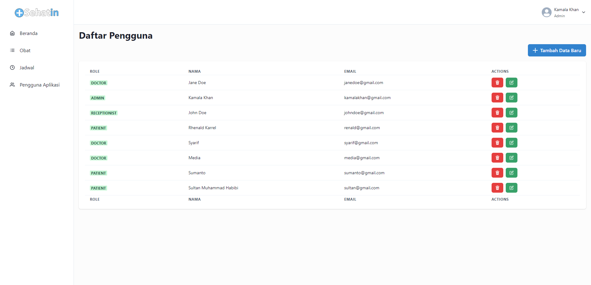

# FE Health 7 - Capstone Project

This is an application intended for the GIGIH Generation 2.0 capstone project. The original repository is on this [link](https://github.com/gg2-sehatin/sehatin). But I did some cleanup on the git due to some errors occurring.

## SehatIn

SehatIn is a Web Application to make it easier for the public to access and assist in increasing the efficiency and effectiveness of health facilities. SehatIn offers Electronic Medical Report as its main feature. In addition, SehatIn also presents a modernization of the health facility system, such as involving technology in all activities at health facilities, be it registration, payment, and taking medicine by patients.

## Features Highlight

Patient

- Register and login
- Change profile
- Make a reservation
- View medical record history, taking medication, and information/payment status
- View a list of reservation history

Doctor

- Login
- Change profile
- View a list of patient medical records
- Entering patient medical record data

Receptionist

- Login
- Change profile
- Manage the patient incoming reservation status
- Monitor patient queue data
- Manage payment status and patient medication collection

Admin

- Login
- Change profile
- Manage users
- Manage medication
- Manage doctor schedule

## How to install & run

How to Clone the project using git and install the dependencies using yarn?

```bash
# Clone this repository
$ git clone https://github.com/gg2-sehatin/sehatin.git

# Go to repository folder
$ cd sehatin

# Install dependencies
$ yarn install
```

How to Run the application?

first, run application on terminal git bash

```bash
$ yarn start
```

and then, run database on another git bash terminal

```bash
$ yarn db
```

## Screenshots


<p align="center">Login Page</p>


<p align="center">Register Page</p>


<p align="center">Admin | Dashboard Page</p>


<p align="center">Admin | Doctor Schedule List Page</p>


<p align="center">Admin | Medicine List Page</p>


<p align="center">Admin | User List Page</p>


<p align="center">Doctor | EMR History Page</p>


<p align="center">Doctor | New EMR Page</p>


<p align="center">Receptionist | Medicine Queue Page</p>


<p align="center">Patient | EMR Detail Page</p>


<p align="center">Patient | EMR History Page</p>


<p align="center">Patient | Reservation History Page</p>


<p align="center">Patient | Reservation Page</p>

## License

[MIT](https://choosealicense.com/licenses/mit/)
